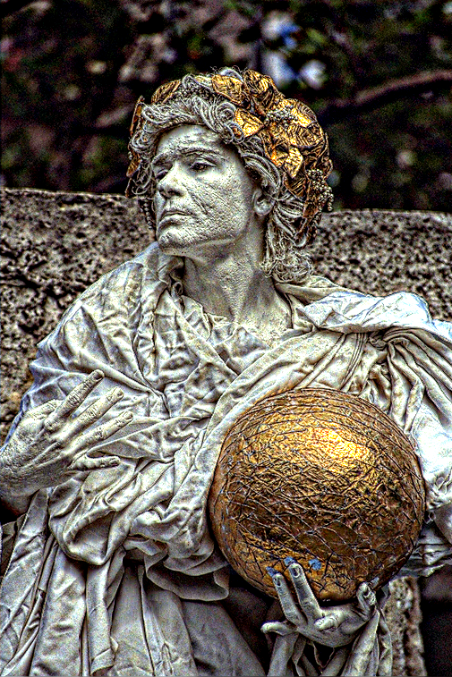

domainTransformFilter
=====================
The newest implimentation of the domainTransformFilter is moved to OpenCP (https://github.com/norishigefukushima/OpenCP)
-------------------------------------------------------------------------------------------

Introduction
------------

The code is OpenCV implimentation of domain transform filter, which is fast edge keep filter for smoothing.  
The code is parallelized by Intel TBB or OpenMP over c cv::ParallelLoopBody class in OpenCV, thus requirement of OpenCV version is 2.45 or later.  
Also, the code is vectorized by SIMD SSE4.2.   

Currentry, two demos, which are smoothing and detail enhancement demo, are called in the program.  
Both demos are quited by 'q' or ESC key.   
 

*Reference  
Eduardo S. L. Gastal and Manuel M. Oliveira. "Domain Transform for Edge-Aware Image and Video Processing". ACM Transactions on Graphics. Volume 30 (2011), Number 4, Proceedings of SIGGRAPH 2011, Article 69.
http://inf.ufrgs.br/~eslgastal/DomainTransform/

Usage
-----

void domainTransformFilter(cv::Mat& img, cv::Mat& out, double sigma_s, double sigma_r, int maxiter, int method=DTF_RF)
 img: src image  
 out: dest image  
 sigma_s: sigma of space  
 sigma_r: sigma of range[0:255]  
 maxiter: number of maximam iteration -1  
 method: filtering method for transformed domain. Only Recursive Filtering is implimented, now.  

typedef enum  
{  
	DTF_RF=0,//Recursive Filtering  
	DTF_NC=1,//Normalized Convolution  
	DTF_IC=1,//Interpolated Convolution  
}DTF_METHOD;  

Results
------

Exsample of test results on core i5-2450M 2.5GHz, Windows 7 64 bit with Visual Studio 2012 are as follows;  

Computational time is about 20 ms for 505x757 RGB image.  
Filtered image are as follows;  

  
Input image  

  
Smooth image  

  
Detail enhanced image  

-------------------------------------------------------------------------------------
This code is forked from https://github.com/tatsy/ImageProcessing .  
pow operations are optimized by fmath.hpp (https://github.com/herumi/fmath) .  

